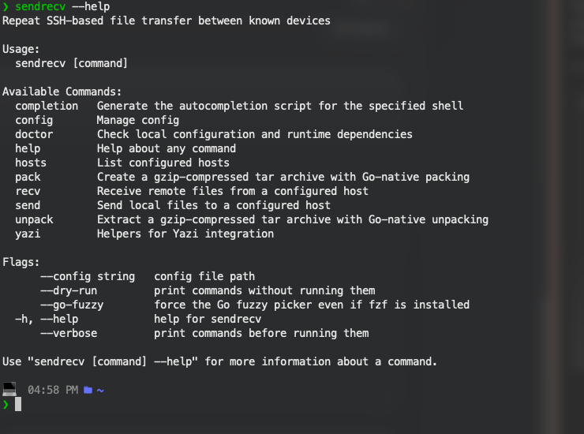

# sendrecv - CLI quick file send/recieve

[](https://github.com/connorpink/quick_send_project/releases)
[](https://github.com/connorpink/homebrew-tap)
[](https://github.com/connorpink/quick_send_project/releases/latest)

`sendrecv` is a Go CLI for repeat SSH-based file transfer between known devices. It keeps the transfer workflow in one binary while relying on `ssh` and `rsync` only at runtime.

## Status

v1 currently targets macOS and Linux. Windows support and a built-in TUI are out of scope for this release.

## Features

- `send` and `recv` subcommands built around host presets
- interactive host picking in `send`, with `fzf` first and Go fallback
- TOML config with per-host defaults
- configurable send transfer mode: `auto`, `raw`, or `archive`
- automatic raw vs archive decision logic in `auto` mode
- Go-native `tar.gz` archive packing and unpacking
- optional auto-extract on the destination side
- strip-common-prefix path mode by default
- opt-in `--preserve-tree`
- `--dry-run` and `--verbose`
- `doctor` checks for required tooling
- documented Yazi integration, including the companion plugin



## Install

See [docs/install.md](./docs/install.md).

Simplest install is **Homebrew**

```bash
brew install connorpink/tap/sendrecv
```

> Linux deb/rpm and MacOS packages also exist.

## Quick start

```bash
sendrecv config init
$EDITOR ~/.config/sendrecv/config.toml
sendrecv config validate
sendrecv hosts
sendrecv send file.mp4
sendrecv send --no-compress ./big-folder
sendrecv send --transfer-mode raw ./big-folder
sendrecv send ./dir
sendrecv send --remote-host laptop ./dir
sendrecv recv laptop nested/file.txt
```

## Runtime dependencies

The local machine needs:

- `ssh`
- `rsync`

The local machine needs `ssh` and `rsync`, and the remote machine also needs `rsync` because transfers run through remote `rsync` over SSH. If the remote host does not expose `rsync` on `PATH`, set `remote_rsync_path` for that host in the config.

For archive-mode `recv`, the remote machine must also have a compatible `sendrecv` binary available on `PATH`, in a standard Homebrew location, or at the configured `sendrecv_path`.

For archive-mode `send`, remote `sendrecv` is optional:

- if remote `sendrecv` exists and extraction is enabled, the archive is unpacked remotely
- if remote `sendrecv` is missing but remote `tar` and `gzip` exist, `sendrecv` falls back to shell extraction on the remote host
- if neither extraction path is available, `sendrecv` uploads the archive directly into `remote_dir` and prints the final archive path
- raw single-file transfers for incompressible files still work with just `ssh` and `rsync`

`send` also supports `--transfer-mode auto|raw|archive`, and `--no-compress` is a shorthand for `--transfer-mode raw`. You can make that the default with `defaults.send_transfer_mode = "raw"` in config.

## Helper commands

Archive-mode remote execution uses:

- `sendrecv pack --output <archive> --base <dir> <members...>`
- `sendrecv unpack --archive <archive> --dest <dir>`

These are normal CLI commands and can be called over SSH by another `sendrecv` instance.

## Remote Doctor

`sendrecv doctor remote <host>` checks:

- remote `rsync`
- remote `sendrecv`
- remote `tar`
- remote `gzip`
- `remote_dir` readiness
- `remote_temp_dir` readiness

If `remote_rsync_path` is configured, remote doctor checks that exact command/path and reports configuration-specific failures.

That makes it possible to see whether the host can do raw transfers only or full archive send/recv flows.

## Config

See [docs/config.md](./docs/config.md) and [examples/config.toml](./examples/config.toml).

## Yazi

Yazi is optional. The CLI remains the source of truth and Yazi should call `sendrecv`, not reimplement it.

The recommended path is the companion plugin, [`connorpink/sendrecv`](https://github.com/connorpink/sendrecv):

```bash
ya pkg add connorpink/sendrecv
```

The plugin reads hosts from `sendrecv hosts --json`, chooses a host inside Yazi, and launches `sendrecv send --remote-host ...` as a background task. See [docs/yazi.md](./docs/yazi.md).

## Architecture

The package boundaries and transfer flow are documented in [ARCHITECTURE.md](.//ARCHITECTURE.md).
